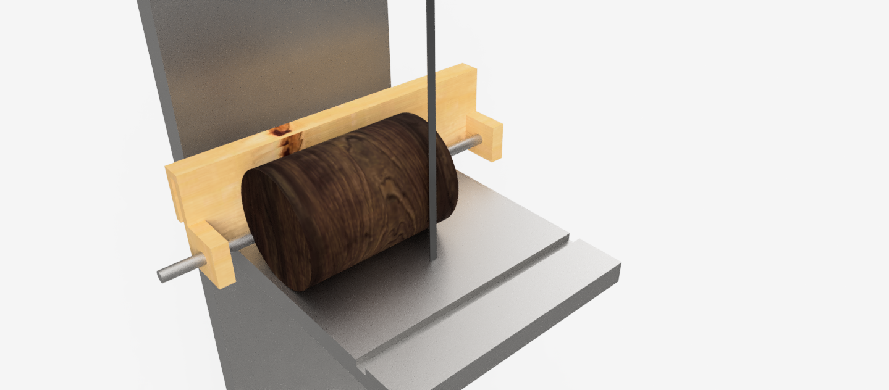
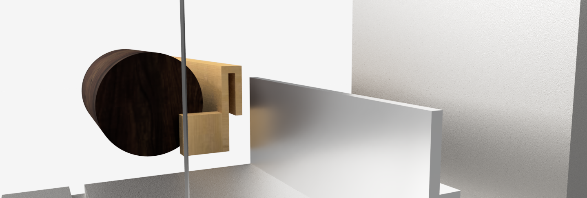

# fusion-360-laguna-14bx-bandsaw-log-jig-with-fence
An AutoDesk Fusion 360 project showing a jig to saw logs on a Laguna 14BX bandsaw; jig slides over the factory fence that comes with the saw.

## Background

I want a jig to saw logs on my bandsaw using a 3/4" pipe clamp. 

In this model, the wooden jig slides over the factory aluminum fence that came with the bandsaw. 

This project was inspired by various blogs, magazines, etc. I found during my Google searches.

This represents my second project with Fusion 360... much to learn, but excited to be progessing with the software :)

## Results

The images below show the jig. It's a simple wooden frame that slides over the factory fence that came with the Laguna 14BX bandsaw. Most designs I saw online incorporated screws and wing nuts / clamps to be able to reposition the jig... but I saw one or two that used the existing fence and that seemed like a much simpler approach. 

