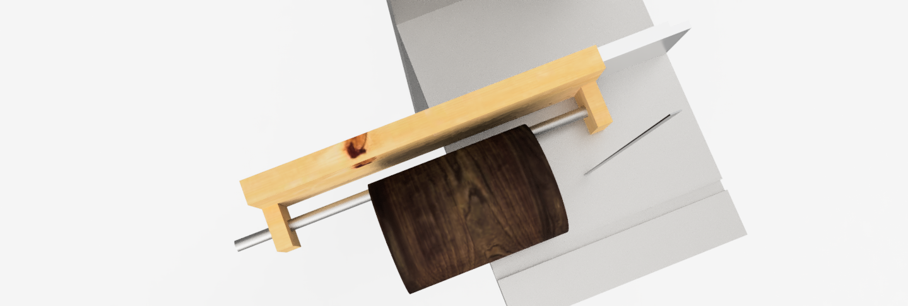

# fusion-360-laguna-14bx-bandsaw-log-jig-with-fence
An AutoDesk Fusion 360 project showing a jig to saw logs on a Laguna 14BX bandsaw; jig slides over the factory fence that comes with the saw.

This is based on actual measurements from the bandsaw, so hopefully when I go to build it, it works well!!

## Background

I want a jig to saw logs on my bandsaw using a 3/4" pipe clamp. 

In this model, the wooden jig slides over the factory aluminum fence that came with the bandsaw. 

This project was inspired by various blogs, magazines, etc. I found during my Google searches.

This represents my second project with Fusion 360 ([the first was a different jig for the same purpose](https://github.com/matwerber1/fusion-360-laguna-14bx-bandsaw-log-jig)). I still have much to learn :)

## Shoutout

My *very* first exposure to anything like this was through the really cool Udemy course, [**Fusion 360 for Woodworkers**](https://www.udemy.com/share/101YGAAEITdlpRTHQF/). At the time I built this project, I had only made it about ~1/2 through the course and was so excited I had to pause it and go build my own project. Highly recommend the course for any woodworker that wants to learn to use 3D modelling software. Note - I have no affiliation to the course author and do not receive any form of compensation from the author or Udemy for this recommendation.

## Results

The images below show the jig. It's a simple wooden frame that slides over the factory fence that came with the Laguna 14BX bandsaw. Most designs I saw online incorporated screws and wing nuts / clamps to be able to reposition the jig... but I saw one or two that used the existing fence and that seemed like a much simpler approach. 

For simplicity, sake of time, and current lack of skill, I have omitted drawing the clamping components that would fix to the 3/4" pipe as well as the screws Ill likely use to joint the jig plates to one another.

For reference, the image below is an example of the clamp components that you would need to affix to the 3/4" pipe. One piece would screw on to a threaded end of the pipe that fits into that rear jig support post and the other piece would be adjustable along the length of the pipe. 

